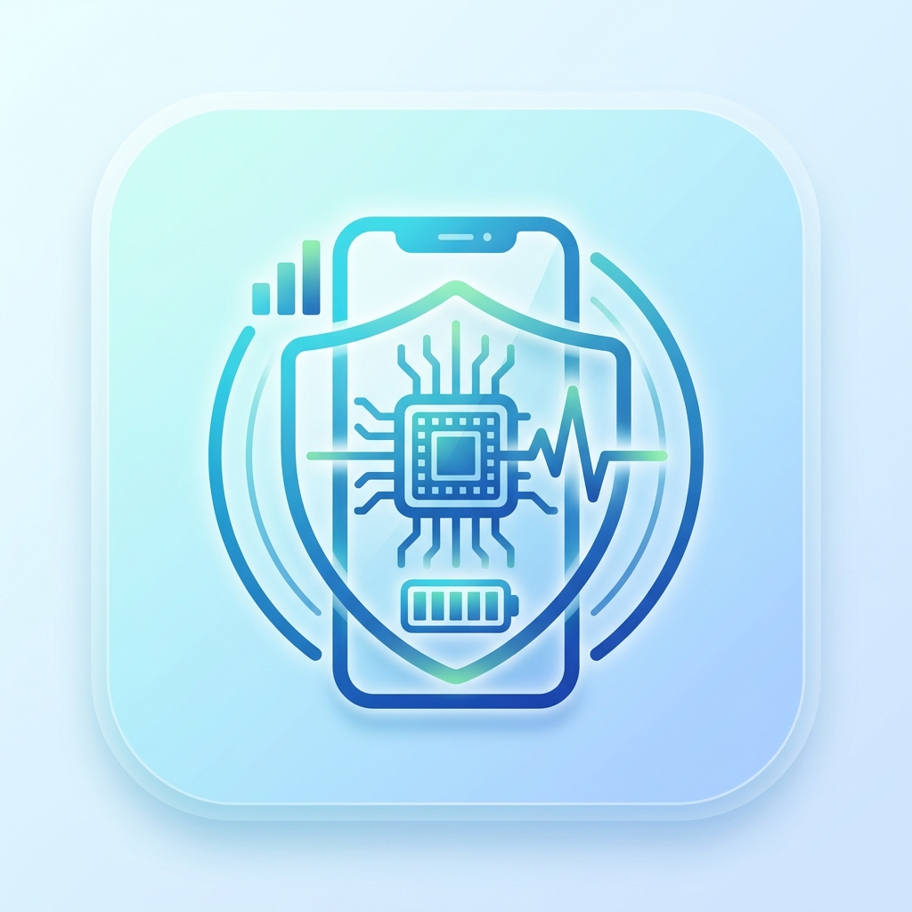

<div align="center">
  
  <h1>DeviceInsight</h1>
  <p><b>The Ultimate Flutter & Android Device Analysis Tool</b></p>
  <p>
    A professional, open-source application built to provide deep insights into your Android device's hardware, software, network, and security status.
  </p>

  <div>
    
    
    
    
  </div>
  <br>
  <div>
    
    
    
    
  </div>
</div>

---

## 📖 Project Overview

**DeviceInsight** is a comprehensive device management and analysis tool crafted entirely in Flutter with deep native Android integrations. 

### Why it was created
With the increasing complexity of modern smartphones, users and developers often lack a centralized dashboard to view hardware capabilities, monitor real-time resource consumption, and assess system security. DeviceInsight bridges this gap by offering a beautiful, responsive, and highly detailed utility app.

### Who it is for
* **End Users:** Looking for a clean interface to monitor their battery health, free up storage, and check network speeds.
* **Android/Flutter Developers:** Needing a reference architecture for integrating `MethodChannels`, `Riverpod`, and Clean Architecture in a production-grade app.
* **Open Source Contributors:** Seeking a robust, well-structured codebase to contribute to and learn from.

### Core Philosophy
* **Performance First:** Utilizing Riverpod for optimized state management and lazy loading.
* **Native Power:** Seamlessly blending Flutter's beautiful UI with Android's underlying APIs via Method Channels.
* **Clean Architecture:** Keeping domain logic separate from presentation and data layers for unmatched scalability.

---

## 📸 Screenshots

*(Contributors: Please place screenshots in a `docs/images/` folder and link them here.)*

| Dashboard | Battery & Power | CPU Metrics | Memory & RAM |
| :---: | :---: | :---: | :---: |
|  |  |  |  |

| Storage Analyzer | Network & Speed | Security Status | App Manager |
| :---: | :---: | :---: | :---: |
|  |  |  |  |

---

## ✨ Features

The application is heavily feature-rich, providing detailed insights across various categories:

* ✅ **Dashboard:** Overview of device stats and quick shortcuts.
* ✅ **Device Information:** Model, manufacturer, board, and OS details.
* ✅ **Battery:** Health, capacity, voltage, temperature, and technology.
* ✅ **CPU:** Cores, architecture, frequencies, and usage.
* ✅ **Memory:** Total RAM, available RAM, and usage thresholds.
* ✅ **Storage:** Internal and external storage analysis.
* ✅ **Display:** Resolution, refresh rate, and physical dimensions.
* ✅ **Network:** Wi-Fi details, IP address, and connection status.
* ✅ **Internet Speed Test:** Built-in download/upload speed analyzer.
* ✅ **Sensors:** Real-time data from accelerometer, gyroscope, magnetometer, etc.
* ✅ **Camera:** Hardware capabilities, megapixels, and flashlight toggle.
* ✅ **App Manager:** View user and system apps, extract icons, and analyze package details.
* ✅ **Security:** Root detection, encryption status, and biometrics.
* ✅ **Permissions:** Detailed view of granted and denied Android permissions.
* ✅ **Diagnostics:** Hardware testing hub (vibration, flashlight, display tests).
* ✅ **Device Care & Optimization:** One-tap optimization and storage cleaning suggestions.
* 📅 **Reports:** Exportable PDF/CSV reports of device stats.

---

## 🛠 Technology Stack

DeviceInsight leverages modern Flutter packages and Android native tools:

| Category | Technology / Package | Purpose |
| :--- | :--- | :--- |
| **Framework** | Flutter, Dart | Cross-platform UI toolkit |
| **State Management** | Riverpod (`flutter_riverpod`, `riverpod_annotation`) | Reactive caching and state management |
| **Routing** | GoRouter (`go_router`) | Declarative routing and deep linking |
| **UI / Design** | Material 3, `google_fonts`, `flutter_animate`, `lottie`, `shimmer`, `dynamic_color` | Animations, typography, and premium UI aesthetics |
| **Native Integration** | Kotlin, Method Channels | Bridging Flutter with native Android APIs |
| **Device Hardware** | `device_info_plus`, `battery_plus`, `sensors_plus`, `package_info_plus` | Fetching hardware stats |
| **Network** | `dio`, `connectivity_plus`, `network_info_plus` | API requests and network status |
| **Storage & Data** | SQLite (`sqflite`), `shared_preferences` | Local caching and persistent settings |
| **Permissions** | `permission_handler` | Managing runtime Android permissions |

---

## 🏗 Architecture

DeviceInsight is built using a **Feature-First Clean Architecture**. This ensures the codebase remains modular, testable, and scalable.

### Key Architectural Concepts
* **Feature-First Folder Structure:** Code is grouped by feature (e.g., `battery`, `cpu`, `network`) rather than by layer.
* **Clean Architecture Layers (Inside each feature):**
  * `presentation/`: Screens, UI components, and Riverpod providers.
  * `domain/`: Entities and abstract Repository interfaces.
  * `data/`: Data sources, DTOs, and Repository implementations.
* **Method Channels:** Extensive use of `MethodChannel('com.example.deviceinsight/native')` to offload heavy hardware querying to Kotlin.
* **Dependency Injection:** Handled natively by Riverpod Providers.

### Folder Tree

```text
lib/
├── core/
│   ├── native/         # Native Method Channels bridging
│   ├── router/         # GoRouter configurations
│   └── theme/          # Material 3 themes and dynamic colors
├── features/
│   ├── apps/           # Installed Applications Manager
│   ├── battery/        # Battery statistics
│   ├── camera/         # Camera hardware info
│   ├── cpu/            # Processor metrics
│   ├── dashboard/      # Main overview screen
│   ├── device/         # General device information
│   ├── device_care/    # Optimization algorithms
│   ├── diagnostics/    # Hardware tests (Vibration, Display, etc.)
│   ├── display/        # Screen metrics
│   ├── memory/         # RAM usage
│   ├── network/        # Wi-Fi and Connectivity
│   ├── optimization/   # Storage cleaning
│   ├── permissions/    # Android permissions manager
│   ├── security/       # Root detection, Biometrics
│   ├── sensors/        # Real-time sensor data
│   ├── shared/         # Reusable widgets and utilities
│   ├── speed_test/     # Network speed analyzer
│   └── storage/        # ROM/Disk space analysis
└── main.dart           # App entry point
```

---

## 🚀 Installation

Follow these steps to run DeviceInsight locally.

### Prerequisites
* Flutter SDK (`^3.12.2` or later)
* Android Studio (with Android SDK)
* Minimum Android SDK version: **21** (Lollipop)
* A physical Android device (Recommended for accurate hardware/sensor data. Emulators will lack certain metrics).

### Steps
1. **Clone the repository:**
   ```bash
   git clone https://github.com/brijeshpadhiyar/deviceinsight.git
   cd deviceinsight
   ```

2. **Install dependencies:**
   ```bash
   flutter pub get
   ```

3. **Generate Riverpod and Freezed files:**
   *(If making changes to providers or models)*
   ```bash
   flutter pub run build_runner build --delete-conflicting-outputs
   ```

4. **Run the app:**
   ```bash
   flutter run
   ```

---

## 🔐 Permissions

DeviceInsight requires several Android permissions to gather accurate metrics. We strictly adhere to transparency regarding data access.

| Permission | Reason | Impact if Denied |
| :--- | :--- | :--- |
| `INTERNET` | Required for the Speed Test and fetching external IP. | Speed test and external IP will fail. |
| `ACCESS_NETWORK_STATE` | To monitor connectivity changes (Wi-Fi vs Mobile). | Network type won't update in real-time. |
| `ACCESS_WIFI_STATE` | To read Wi-Fi SSID, BSSID, and link speed. | Wi-Fi details will be hidden. |
| `BATTERY_STATS` | To provide deep battery insights. | Basic battery level available, advanced stats disabled. |
| `CAMERA` | To read hardware camera capabilities and test flashlight. | Camera info and flashlight diagnostic will fail. |
| `USE_BIOMETRIC` / `FINGERPRINT` | To test security sensors. | Security dashboard will show biometric as unsupported. |
| `READ/WRITE_EXTERNAL_STORAGE` | For Android 12 and below, to analyze storage space. | Storage analyzer will lack detail. |
| `READ_MEDIA_*` | For Android 13+, replacing external storage permissions. | Storage breakdown by media type won't work. |
| `QUERY_ALL_PACKAGES` | To list installed user and system apps. | App Manager will be completely empty. |
| `PACKAGE_USAGE_STATS` | To determine which apps are consuming background resources. | Advanced app analytics disabled. |

---

## 📱 Screens Overview

| Screen Name | Purpose | Status |
| :--- | :--- | :--- |
| **Dashboard** | Main hub for quick stats and navigation. | ✅ Complete |
| **DeviceScreen** | Displays brand, model, OS, and build info. | ✅ Complete |
| **BatteryScreen** | Deep dive into battery health, voltage, and temp. | ✅ Complete |
| **CpuScreen** | Shows core count, architecture, and live clock speeds. | ✅ Complete |
| **MemoryScreen** | Real-time RAM usage and available memory. | ✅ Complete |
| **StorageScreen** | Disk usage breakdown (Internal & External). | ✅ Complete |
| **DisplayScreen** | Screen resolution, density, refresh rate. | ✅ Complete |
| **NetworkScreen** | Wi-Fi details, signal strength, IPs. | ✅ Complete |
| **SpeedTestScreen** | Live download and upload network testing. | ✅ Complete |
| **SensorsScreen** | Live data output for all hardware sensors. | ✅ Complete |
| **CameraScreen** | Camera hardware specs and flashlight toggle. | ✅ Complete |
| **SecurityScreen** | Root status, encryption, and biometric checks. | ✅ Complete |
| **AppsScreen** | List of all installed packages (System/User). | ✅ Complete |
| **AppDetailsScreen** | Detailed view of a specific app's info and manifest. | ✅ Complete |
| **PermissionsDashboard** | Overview of system-wide granted permissions. | ✅ Complete |
| **DiagnosticsHub** | Suite of interactive hardware tests. | ✅ Complete |
| **DeviceCare** | One-tap system optimization animation/suggestions. | ✅ Complete |
| **StorageCleaner** | UI for analyzing junk and cache files. | ✅ Complete |

---

## ⚠️ Android Limitations

Modern Android versions (Android 11+) have introduced strict security and privacy policies that affect utility apps. DeviceInsight respects these boundaries:

* **RAM Cleaning / Task Killing:** Since Android 14, apps can no longer kill background processes of other apps arbitrarily. The "Optimization" feature relies on system-provided APIs to suggest cleanup rather than force-stopping apps.
* **Silent Cache Clearing:** Apps cannot silently clear the cache of other applications without user interaction. We direct users to the system settings page for the specific app.
* **Silent Uninstall:** Uninstalling apps requires explicit user confirmation via the Android package installer UI.

---

## ⚡ Performance Optimization

To ensure a smooth 60/120fps experience while dealing with heavy hardware polling, we utilize:

1. **Riverpod Caching:** Hardware data that doesn't change frequently (like CPU architecture) is read once and cached.
2. **Const Widgets:** Extensive use of `const` constructors to prevent unnecessary widget rebuilds.
3. **Method Channel Throttling:** Rapid polling of sensors is done natively and throttled before sending over the platform channel to Flutter.
4. **Lazy Loading:** Lists in the App Manager use `ListView.builder` to lazy-load application icons (which are heavily decoded byte arrays) only when scrolled into view.

---

## 🗺 Roadmap

* **Version 1.0 (Current):** Core metrics, App Manager, Clean Architecture integration, and Diagnostics.
* **Version 1.5:** Implement exportable PDF/CSV reports.
* **Version 2.0:** Introduce background battery usage tracking and historical charts.
* **Version 3.0:** Desktop support (Windows/macOS/Linux) leveraging Dart FFI.

---

## 🤝 Contributing

We welcome contributions from the community! 

### How to Contribute
1. **Fork** the repository.
2. **Clone** your fork locally.
3. Create a **feature branch**: `git checkout -b feature/awesome-new-feature`
4. Commit your changes.
5. Push to the branch: `git push origin feature/awesome-new-feature`
6. Open a **Pull Request**.

### Guidelines
* **Branch Naming:** Use `feature/<name>`, `bugfix/<name>`, or `refactor/<name>`.
* **Commit Messages:** Follow [Conventional Commits](https://www.conventionalcommits.org/). (e.g., `feat: add temperature chart to battery screen`).
* **Architecture:** Adhere strictly to the Feature-First Clean Architecture structure. Ensure state is managed via Riverpod.
* **Linting:** Run `flutter analyze` before pushing. Fix any warnings.

---

## 🧪 Testing

DeviceInsight aims for high test coverage.

* **Unit Tests:** Run `flutter test` to execute tests for Data Repositories and Domain logic.
* **Widget Tests:** UI tests for critical screens to ensure rendering integrity.
* *(Integration tests using `integration_test` are planned for future releases).*

---

## 📄 License

This project is licensed under the MIT License - see the [LICENSE](LICENSE) file for details.

---

## 👨‍💻 Author

**DeviceInsight Team / Maintainer**
* **GitHub:** [brijeshpadhiyar](https://github.com/brijeshpadhiyar)
* **LinkedIn:** [Insert LinkedIn Profile](#)
* **Portfolio:** [Insert Portfolio URL](#)
* **Email:** [Insert Email](#)

---

## 🙏 Acknowledgements

* **[Flutter](https://flutter.dev):** For the incredible cross-platform UI framework.
* **[Android Developers](https://developer.android.com/):** For the detailed native APIs.
* **[Material Design](https://m3.material.io/):** For the beautiful design guidelines.
* **Open Source Community:** Thanks to the maintainers of Riverpod, GoRouter, and the Flutter Community `plus` plugins for making this project possible.

<div align="center">
  <p>Made with ❤️ using Flutter</p>
</div>
